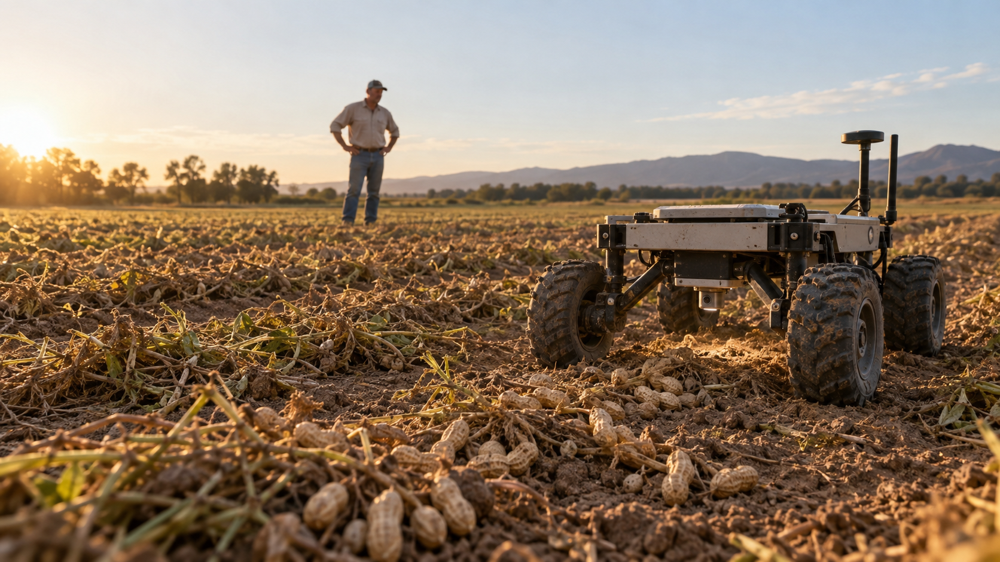
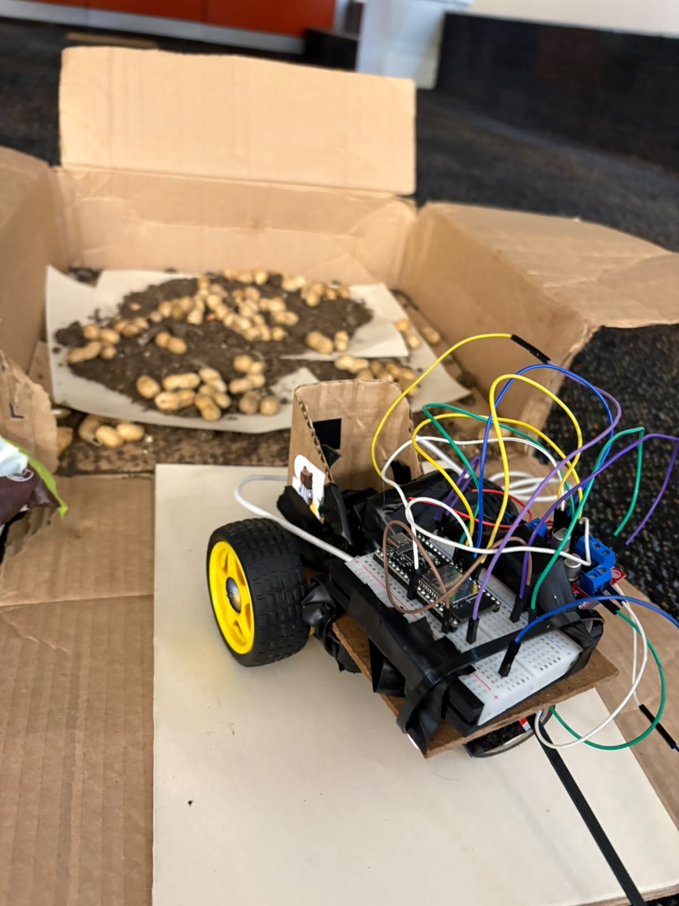
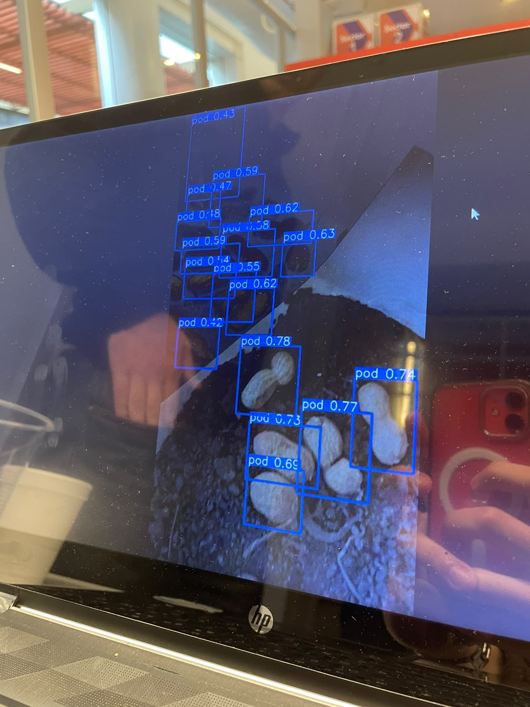
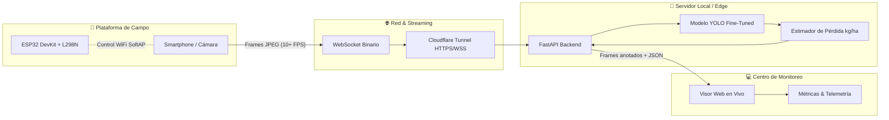
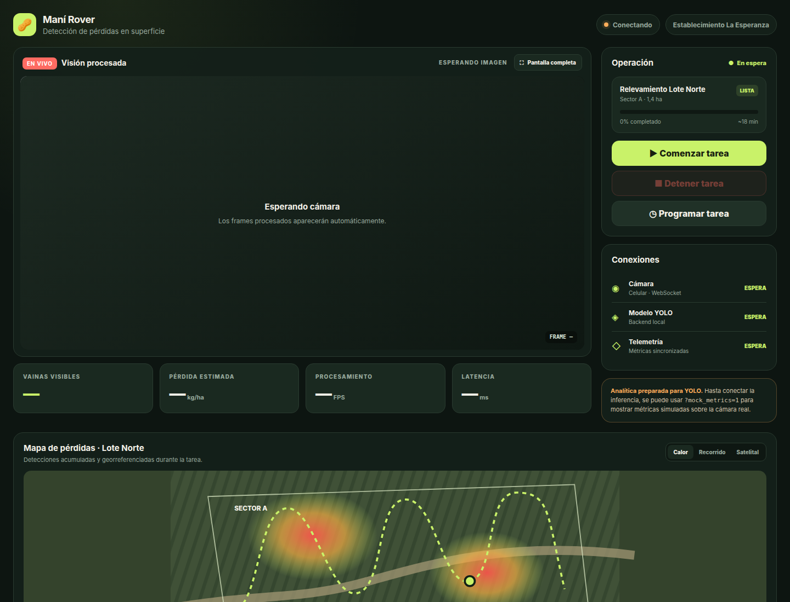

<div align="center">

# 🥜 REHAR — Visión para Entender la Pérdida
### *Transforming Waste into Value*

**Robot Terrestre & Sistema de Visión Artificial (YOLO) para Detección y Estimación de Pérdidas en Cosecha de Maní en Tiempo Real**

Desarrollado para la [**HackCBA (Hackathon Córdoba)**](https://www.hackcba.com/)

[](https://www.hackcba.com/)
[](https://www.hackcba.com/)
[](https://www.hackcba.com/)

<p align="center">
  
  
  
  
  
  
  
</p>

<br>



*Render conceptual de la plataforma móvil Rehar operando sobre rastrojo de maní.*

</div>

---

## 🏆 Reconocimientos en HackCBA

Durante la edición de **HackCBA**, **Rehar** fue galardonado con una doble distinción otorgada por el jurado interdisciplinario de referentes de la industria tecnológica y agropecuaria:

| Puesto | Categoría / Track | Descripción |
| :---: | :---: | :--- |
| 🥇 **1º Lugar** | **Track Agro** | Solución más innovadora y con mayor impacto de aplicación real en el sector agropecuario argentino. |
| 🥈 **2º Lugar** | **Track Inteligencia Artificial** | Excelencia técnica en entrenamiento, optimización y despliegue de modelos de Computer Vision (YOLO) en tiempo real con baja latencia. |

---

## 🌾 El Problema: Pérdidas Invisibles en el Maní

Córdoba concentra más del **90% de la producción manicera de Argentina**, alcanzando entre **1.8 y 2 millones de toneladas** por campaña. Sin embargo, la cosecha ocurre en dos etapas críticas: **arrancado** e **inversión**, y posterior **descapotado/recolección**.

```text
  [ Rinde Promedio ]           [ Pérdida Estimada ]           [ Impacto en 500 ha ]
   ~3.000 kg / ha     --->        8% al 10%         --->        60 a 150 Toneladas
                               (~300 kg/ha)                ≈ $45.000+ USD perdidos en tierra
```

* **El desafío actual:** El muestreo agronómico manual mediante marcos de alambre es lento, puntual y cubre menos del 0.01% de la superficie real del lote.
* **Nuestra propuesta:** Automatizar la inspección superficial mediante una plataforma robótica ligera con cámara inteligente y visión computacional para mapear, contar y estimar la pérdida en kilogramos por hectárea de forma continua y georreferenciada.

---

## 💡 La Solución REHAR

**Rehar** es una prueba de concepto (MVP) integral que une hardware robótico, visión por computadora en el borde y telemetría web en tiempo real:

1. 🤖 **Rover Móvil Terrestre:** Plataforma controlada por un microcontrolador **ESP32** vía Wi-Fi, diseñada para desplazarse de forma estable sobre la superficie del lote.
2. 📱 **Sensor Óptico de Borde:** Dispositivo móvil montado en el chasis que transmite frames de video de alta definición a través de **WebSockets binarios de baja latencia**.
3. 🧠 **Inferencia YOLO en Tiempo Real:** Modelo de Deep Learning (YOLO) optimizado y fine-tuneado con datasets locales para segmentar y detectar vainas de maní ("cajas") camufladas entre tierra y rastrojo.
4. 📊 **Dashboard & Telemetría en Vivo:** Panel de control agronómico que calcula en vivo:
   * Conteo de vainas por frame y densidad.
   * Estimación proyectada de **kg/ha perdidos**.
   * Monitoreo de FPS, latencia y enlace de comunicación.

---

## 🤖 El Robot Demostrador (Hardware & Montaje)

Para la demostración en vivo de la hackathon se construyó un **prototipo funcional** capaz de recorrer una bandeja de pruebas con tierra real, rastrojo y vainas de maní esparcidas.

<div align="center">

### 📸 Demo en Vivo durante la Hackathon

| 🚜 Prototipo Móvil (Rover ESP32) | 🧠 Inferencia YOLO en Tiempo Real |
| :---: | :---: |
|  |  |
| *Chasis robótico con ESP32, puente H L298N, soporte para smartphone y pista de pruebas con tierra y maní.* | *Detección de vainas en vivo recibiendo el streaming de video del celular durante la evaluación de los jurados.* |

</div>

### Especificaciones de Hardware
- **Cerebro:** ESP32 DevKit v1 (comunicación Wi-Fi SoftAP / Station y servidor de telemetría HTTP/WebSocket).
- **Driver de Potencia:** Puente H doble **L298N** con control PWM independiente para regulación de velocidad.
- **Tracción:** Motores DC con reducción (1:48) y ruedas de alto agarre con rueda loca frontal.
- **Alimentación Aislada:** Pack dedicado de baterías NiMH (7.2V nominales) para evitar caídas de tensión por ruido inductivo de los motores, más powerbank USB de 5V independiente para lógica y ESP32.
- **Seguridad:** Watchdog de comandos integrado (parada de emergencia automática ante pérdida de señal en 500 ms).

---

## 📐 Arquitectura del Sistema



---

## 🧠 Visión Computacional e Inteligencia Artificial

<div align="center">
  
  <p><em>Inferencia del modelo YOLO detectando vainas de maní sobre suelo real con bounding boxes y puntuación de confianza.</em></p>
</div>

### Metodología de Entrenamiento
1. **Transfer Learning & Preentrenamiento:** Base sobre pesos YOLOv8 / YOLO26 preentrenados en COCO y adaptados al dominio agrícola con el dataset Tifton Peanut Pods.
2. **Dataset Propio (Fine-Tuning):** Curación y etiquetado de fotografías tomadas en suelo y condiciones de luz similares a los campos de la región manicera cordobesa (`cv/Datasets/FotosPropias`).
3. **Optimización en Inferencia:** Pipeline asíncrono con descarte de cola para garantizar que nunca se acumule latencia en la transmisión hacia el operador.

### Fórmula Demostrativa de Estimación (kg/ha)
El backend calcula la densidad instantánea de vainas mediante la relación entre el área visual calibrada de la cámara y el peso promedio por grano:

$$\text{Pérdida (kg/ha)} = \frac{\text{Vainas Detectadas} \times \text{Peso Promedio (g)} \times 10}{\text{Área Calibrada del Frame } (\text{m}^2)}$$

---

## 🖥️ Dashboard & Visor en Vivo

El sistema incluye una interfaz moderna sin dependencias externas pesadas (HTML5 / Vanilla JS / CSS Grid):

<div align="center">
  
</div>

- **Monitor de Cámara:** Streaming con overlay de cajas de detección y etiquetas de confianza.
- **Telemetría en tiempo real:** Medidor de FPS, latencia de ida y vuelta e indicador de señal.
- **Estimación Instantánea:** Lecturas en kg/ha y conteo acumulado para toma rápida de decisiones.

---

## 📂 Estructura del Repositorio

```text
├── cv/                     # Computer Vision & Modelos
│   ├── Datasets/           # Datasets Tifton y Fotos Propias
│   ├── Models-Roboflow/    # Pesos entrenados, matrices de confusión y curvas F1/mAP
│   ├── notebooks/          # Notebooks de evaluación y benchmark
│   └── scripts/            # Scripts de preparación, conversión COCO y fine-tuning
├── docs/                   # Documentación técnica, esquemas y PINOUT
│   ├── assets/robot/       # 📸 Fotos y recursos del prototipo físico
│   ├── PINOUT.md           # Diagrama detallado de conexiones L298N <-> ESP32
│   ├── contexto.md         # Marco teórico agronómico y alcance
│   └── robot-esp32.md      # Guía de ensamblado y configuración del hardware
├── firmware/               # Código embebido
│   └── RobotESP32/         # Sketch de Arduino/C++ para ESP32 DevKit
├── landing/                # Sitio web institucional y presentación de Rehar
│   ├── assets/             # Renders 3D, muestras e ilustraciones
│   ├── index.html          # Landing page interactiva
│   └── styles.css          # Diseño responsive con estética agro-tech
├── presentacionhack/       # Pitch deck oficial presentado en HackCBA
├── web/                    # Frontend del Visor de Telemetría (Camera + Viewer)
└── webcam/                 # Backend de relay WebSocket (FastAPI) e integración YOLO
```

---

## 🚀 Puesta en Marcha (Quickstart)

### 1. Iniciar el Backend de Inferencia & Relay Web
```bash
# Navegar al directorio del servidor
cd webcam

# Crear y activar entorno virtual
python3 -m venv .venv
source .venv/bin/activate  # En Windows: .venv\Scripts\Activate.ps1

# Instalar dependencias
pip install -r requirements.txt

# Ejecutar el servidor FastAPI
python -m uvicorn backend.main:app --host 0.0.0.0 --port 8000 --reload
```

Abrir en navegador:
* **Cámara (dispositivo móvil):** `https://<tu-url-cloudflare>/camera`
* **Visor / Operador:** `http://localhost:8000/viewer`

### 2. Flashear el Firmware del Robot (ESP32)
1. Abrir `firmware/RobotESP32/RobotESP32.ino` en **Arduino IDE**.
2. Seleccionar la placa `ESP32 Dev Module`.
3. Conectar el ESP32 vía micro-USB y flashear.
4. Conectarse a la red Wi-Fi generada por el robot: `Robot-ESP32` (password: `robot-esp32`) para controlarlo mediante joystick virtual o comandos HTTP.

---

## 🔭 Próximos Pasos (Roadmap)

- [ ] **Módulo de Aspiración / Recolección:** Integración de un mecanismo industrial de aspirado selectivo accionado por la detección de YOLO.
- [ ] **Georreferenciación RTK-GPS:** Generación automática de mapas de calor SHP / GeoJSON compatibles con monitores de rendimiento de cosechadoras.
- [ ] **Procesamiento On-Device:** Portar el modelo a formatos TensorRT / NCNN para ejecución local en Nvidia Jetson Orin Nano montada en el chasis.

---

## 👥 Equipo

Proyecto desarrollado por:

<div align="center">

| [<br /><sub><b>Enzo Fernandez</b></sub>](https://github.com/EnzoFernandezz11) | [<br /><sub><b>Tomás Ossana</b></sub>](https://github.com/ossanaTomas) | [<br /><sub><b>Ignacio A. Verdinelli</b></sub>](https://github.com/IgnacioAVerdinelli) | [<br /><sub><b>Valentino Giosso</b></sub>](https://github.com/valegiosso) |
| :---: | :---: | :---: | :---: |
| [@EnzoFernandezz11](https://github.com/EnzoFernandezz11) | [@ossanaTomas](https://github.com/ossanaTomas) | [@IgnacioAVerdinelli](https://github.com/IgnacioAVerdinelli) | [@valegiosso](https://github.com/valegiosso) |

</div>

---

## 🙏 Agradecimientos

Proyecto creado con pasión durante las intensas jornadas de **HackCBA 2026**.

Agradecemos a la organización de **[HackCórdoba / HackCBA](https://www.hackcba.com/)**, a los mentores del sector agropecuario y al jurado por valorar el potencial de unir **Inteligencia Artificial y Robótica al servicio del campo argentino**.

<div align="center">
  <sub>Hecho con 💚 y 🥜 en Córdoba, Argentina.</sub>
</div>

